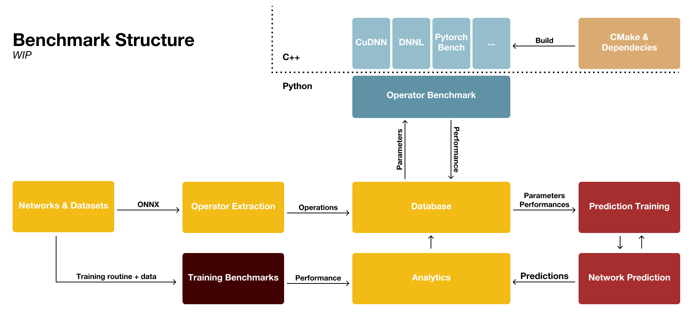

# Deep Learning Workload Evaluation Tools

This repository contains a collection of tools used to test and implement the methodology presented in "A Systematic Approach for Evaluating Deep Learning Workloads".
They can be used to benchmark and analyze deep neural network (NN) training and inference at the NN operator level.  
In the current state the starting point is the __benchmark.py__ script at ([Core/benchmark.py](Core/benchmark.py)). This script can be configured to collect and log the diagnostics of interest. The overall structure is illustrated below. 



## Adding Operator Benchmarks ##
To add a new benchmark for an operator two steps need to be done.

### 1. Add the benchmark executable ###
The benchmarks are executed by the python runtime. 
Benchmarks are executables that take a **path** to an input csv file and 
output the performance of each operation defined in the input file.
The input csv file is formatted as following:
```
0, param1, param2, param3, ...
1, param1, param2, param3, ... 
...
```
The inputfiles are stored in the Runtimefiles directory that is created once 
the benchmark is run.  
The benchmarks need to write an output file with the name "\*\*input filename\*\*_out.csv". It needs to be formatted as following:
```
id, unit
0, 234.32
1, 2324.1
...
``` 
In the first line the unit for the time measurement is set, otherwise ms is the default unit.
To add new executables to the benchmark the executable needs to conform with these requirements.
Either a prebuild executable can be added or a new build target with the source files can be added to the system.
#### 1.1a Add a prebuild executable
A prebuild executable only needs to be referenced by the main benchmark as described in 2.
#### 1.1b Add a new build target with source files
To add a new benchmark that is build with the cmake build system add the source files in a new subdirectory in [OperatorBenchmarks](OperatorBenchmarks).
Include the directory in the main [CMakeLists.txt](OperatorBenchmarks/CMakeLists.txt) with *add_subdirectory(name)*.
Create a CMakeLists.txt in the subdirectory and define the target, link the necessary libraries as well as the header files.  
Example CMakeLists.txt for the intel/convolution benchmark:  
```
# define target
add_executable(intel_conv std_conv_bench.cpp)

# find MKLDNN
find_package(MklDNN)

# include headers
target_include_directories(intel_conv PRIVATE ${MKLDNN_INCLUDE_DIR})

# link prebuild library
add_library(mkldnn SHARED IMPORTED)
target_link_libraries(intel_conv mkldnn)
set_target_properties(mkldnn PROPERTIES IMPORTED_LOCATION ${MKLDNN_LIBRARY})
```
Custom CMake find packages for special library dependencies can be added in [OperatorBenchmarks/cmake](OperatorBenchmarks/cmake).  
Build the executable with the main build system as described here: TODO:add link  
### 2. Reference the benchmark in the python runtime ###
Every benchmark is defined in [Core/Runtimetools/__init__.py](Core/Runtimetools/__init__.py).
When the runtime is initialised all benchmarks with an executable in the respective location will be available for execution.  
A standard entry looks as following:  
```
OperatorBenchmark(name="CPU_Convolution2D",
              synonyms=["Conv"],
              exe="OperatorBenchmarks/build/intel/convolution/intel_conv",
              param_descr=["N", "C", "H", "W", "K", "kernel_shape_0", "kernel_shape_1", "pads_0", "pads_1", "strides_0", "strides_1"]
              )
```  
The **name** field defines a descriptive name for the operator benchmark.  
The **synonyms** indicate which onnx *op_types* shall be associated with this benchmark. 
The name is also part of the synonyms. The synonyms and name govern the mapping from the operators in the database to the operator benchmarks.  
The **param_descr** describe the order and assignment of accepted parameters. If there is an operator with the 
parameter_descriptors: ["W", "H", "C", "N"] and a benchmark defined with param_descr: ["N", "C", "H", "W"] the 
parameters will automatically reordered. If the assignment of the parameters are ambiguous the assignment is done by order.  
It is possible to discard parameters! If the benchmark takes less parameters as supplied by the database, unassigned parameters are discarded.

## Adding Training Benchmarks ##

To add a new Training benchmark two things need to be done:  
1. Instrument the training code with the respective analytics
2. Register the benchmark in the benchmark runtime

### Instrumenting Training Scripts ###
The benchmark currently only supports pytorch. Any trainable pytorch network can be added by instrumenting the main training loop.
For this the Runtimetool/benchmark_diagnostics contain wrappers. An example instrumentation would be as following:

```
    from Runtimetools.benchmark_diagnostics import op_performance_analysis_cpu
    
    ...
    
    for batch_idx, (inputs, targets) in enumerate(trainloader):
        with op_performance_analysis_cpu(batch_idx): # <-- Include the diagnostics wrapper 
            # standard training loop
            inputs, targets = inputs.to(device), targets.to(device)
            optimizer.zero_grad()
            outputs = net(inputs)
            loss = criterion(outputs, targets)
            loss.backward()
            optimizer.step()
            # end loop
```

After training a file with diagnostics for a single batch with the measured time performances of the operations is written
to the runtimefiles and loaded by the main benchmark script. Note: This currently only measures a single batch, average of multiple batches is wip. 
Instrumenting the training introduces latency to the overall training time.

### Registering the Training Benchmark ###
Similar to registering an operator benchmark, the training benchmark needs to be registered in [Core/Runtimetools/__init__.py](Core/Runtimetools/__init__.py).
A standard entry looks as following:  
```
TrainingBenchmark(name="Resnet50_cifar10",
              parameters=" --batch-size 128 --epochs 1",
              exe="TrainingBenchmarks/Resnet50_cifar10.py"
              )
```   
The **name** field defines a descriptive name for the training benchmark.  
The **parameters** are optional parameters that control the hyperparameters of the training. 
All parameters that are normally passed to the script can be included here.
The idea is that complete training scripts can easily be included into the benchmark without major changes.